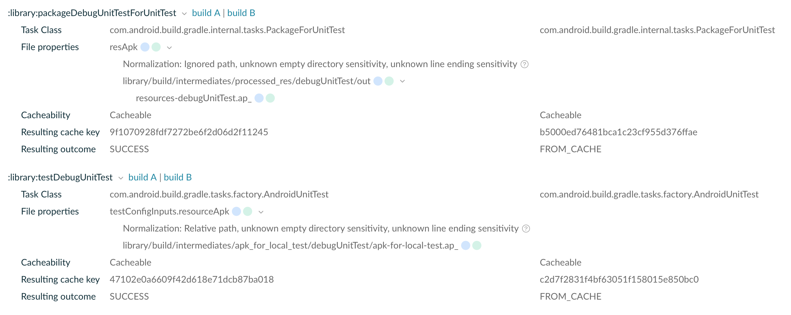

### Cache misses for tasks PackageForUnitTest and AndroidUnitTest
Modules using testOption `includeAndroidResources = true` cause cache misses when building with different
architectures. Tasks affected:
* PackageForUnitTest
* AndroidUnitTest

AGP versions reproducing this issue:
7.1, 7.2, 7.3 and 7.4

#### Steps to reproduce the issue
1. Clone Repository
2. Build repo with environment aarch64
3. Build repo with environment x86_64
4. Compare Build Scans
